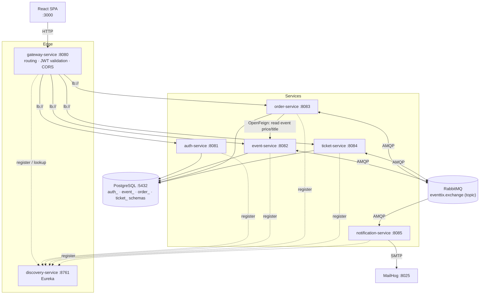
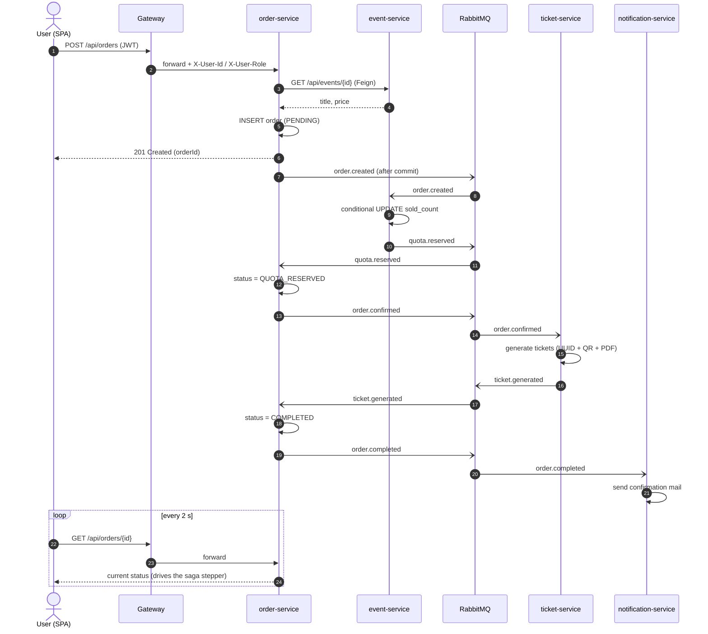
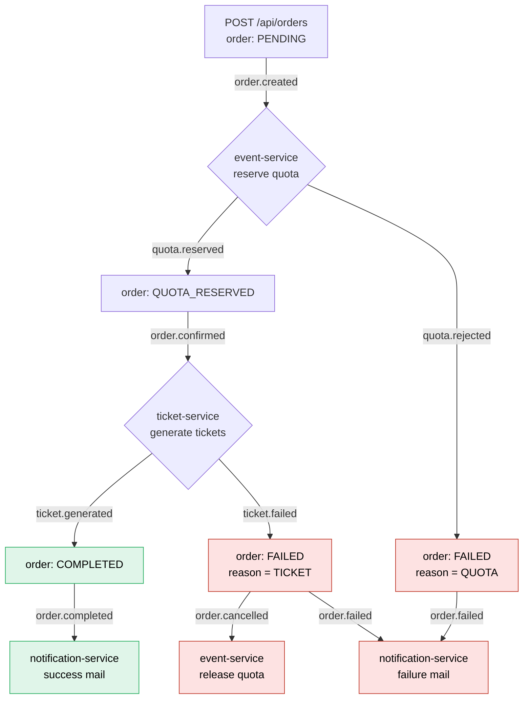

# EventTix

EventTix is an event ticketing platform built as Spring Boot microservices, where every purchase runs as a distributed transaction coordinated by a choreography-based saga over RabbitMQ.


> _Placeholder: `docs/demo.gif` — purchase flow with the live saga stepper (Order received → Quota reserved → Tickets ready)._

**Stack:** Java 21 · Spring Boot 3 · Spring Cloud (Gateway, Eureka, OpenFeign) · PostgreSQL 16 · RabbitMQ 3 · React 18 (Vite, Tailwind) · Docker Compose

---

## Architecture

### System overview



**Communication rules**

- **Synchronous (REST):** read-only, and only gateway → service, plus `order-service` → `event-service` (OpenFeign) to read the event's price and title when an order is placed.
- **Asynchronous (RabbitMQ):** every cross-service state change.

### Order placement — sequence



---

## Services

| Service | Port | Responsibility | Schema |
|---|---|---|---|
| `discovery-service` | 8761 | Eureka server — service registry | — |
| `gateway-service` | 8080 | Single entry point: routing, JWT validation, CORS | — |
| `auth-service` | 8081 | Users, registration/login, JWT issuing | `auth_schema` |
| `event-service` | 8082 | Event CRUD, quota reservation and release | `event_schema` |
| `order-service` | 8083 | Order lifecycle, saga state transitions | `order_schema` |
| `ticket-service` | 8084 | Ticket generation (QR + PDF), ticket queries | `ticket_schema` |
| `notification-service` | 8085 | Order result e-mails (MailHog) | — (stateless) |
| `frontend` | 3000 | React SPA; talks to the gateway only | — |

**Database:** a single PostgreSQL container with a **dedicated schema and DB user per service**. No service is granted access to another service's schema — logically database-per-service, physically one container to keep local development lightweight. Each service owns its schema through its own Flyway migrations (`ddl-auto: validate`).

**Trust boundary:** the gateway validates the JWT and forwards `X-User-Id` / `X-User-Role` headers. Downstream services trust these headers, which is acceptable only because they are reachable exclusively inside the Compose network.

---

## Getting started

**Prerequisites:** Docker (with Compose v2), Node.js 20+ for the frontend.

```bash
git clone https://github.com/sehaaz/eventix.git
cd eventix
cp .env.example .env
docker compose up --build
```

> The first build downloads Maven dependencies for every service and takes several minutes. Services start in order: PostgreSQL & RabbitMQ → Eureka → gateway & business services.

Start the frontend:

```bash
cd frontend
npm install
npm run dev
```

Open **http://localhost:3000**. The event catalogue is seeded by Flyway.

### Demo users

No users are seeded. Register through the UI (`/register`) — new accounts get the `USER` role.

| Role | E-mail | Password |
|---|---|---|
| USER | _register via UI_ | _your choice_ |
| ADMIN | _register, then promote (below)_ | _your choice_ |

To grant admin rights to a registered account:

```bash
docker compose exec postgres psql -U postgres -d eventtix \
  -c "UPDATE auth_schema.users SET role = 'ADMIN' WHERE email = 'you@example.com';"
```

Log in again afterwards so the new role is included in the JWT.

---

## Useful links

| Tool | URL | Credentials |
|---|---|---|
| Frontend | http://localhost:3000 | — |
| API gateway | http://localhost:8080 | JWT |
| Swagger — auth | http://localhost:8081/swagger-ui.html | — |
| Swagger — event | http://localhost:8082/swagger-ui.html | — |
| Swagger — order | http://localhost:8083/swagger-ui.html | — |
| Swagger — ticket | http://localhost:8084/swagger-ui.html | — |
| Eureka dashboard | http://localhost:8761 | — |
| RabbitMQ management | http://localhost:15672 | `eventtix` / `eventtix` (from `.env`) |
| MailHog | http://localhost:8025 | — |

---

## Why microservices? How is the distributed transaction solved?

Placing an order touches three independently owned pieces of state: **quota** in `event-service`, the **order** in `order-service`, and **tickets** in `ticket-service`, each in its own schema. There is no single database transaction that can span them, so the purchase is modelled as a **choreography-based saga**: every service performs a local transaction and publishes an event; failures trigger compensating events that undo earlier steps.

All messages go through the `eventtix.exchange` topic exchange and share one envelope: `{ sagaId, eventType, occurredAt, payload }`, where `sagaId` is the order ID.

### Saga flow



### Compensation steps

| Failure | Detected by | Compensation |
|---|---|---|
| Not enough quota | `event-service` publishes `quota.rejected` | `order-service` marks the order `FAILED (QUOTA)` and publishes `order.failed` → failure e-mail. Nothing was reserved, so nothing to undo. |
| Ticket generation fails | `ticket-service` publishes `ticket.failed` | `order-service` marks the order `FAILED (TICKET)` and publishes `order.cancelled` + `order.failed`. `event-service` consumes `order.cancelled` and releases the reserved quota (`sold_count -= qty`, reservation row deleted); the user receives a failure e-mail. |

Quota reservation itself is race-free: it is a single conditional update, so overselling is impossible even under concurrent orders.

```sql
UPDATE events SET sold_count = sold_count + :qty
WHERE id = :id AND sold_count + :qty <= total_quota;
```

### Reliability rules

- **Publish after commit** — events are published only after the local transaction commits (`TransactionSynchronization.afterCommit`), so a rolled-back local transaction never emits a message.
- **Durable queues + DLQ** — every queue is durable and dead-letters to `eventtix.dlx` → `<queue>.dlq` after 3 failed delivery attempts.

### Why a saga and not two-phase commit (2PC)?

- **Availability:** 2PC holds locks across services until a coordinator decides; a slow or crashed participant blocks everyone. A saga only holds short local transactions.
- **Loose coupling:** services communicate through events and never need to be online at the same time. RabbitMQ buffers messages if a consumer is down.
- **Infrastructure fit:** 2PC requires XA-capable resources and a transaction manager spanning PostgreSQL and RabbitMQ — heavy, poorly supported, and rarely used in cloud-native systems.
- **Trade-off accepted:** a saga is eventually consistent. An order is briefly `PENDING` / `QUOTA_RESERVED`, which the UI makes explicit with the saga stepper instead of hiding it.

---

## What if the same message arrives twice?

RabbitMQ guarantees at-least-once delivery, so every consumer is idempotent, keyed on `sagaId` (= order ID):

- **event-service** records each reservation in `quota_reservations` with `order_id` as the primary key; a duplicate `order.created` finds the existing row and does not reserve again, and a duplicate `order.cancelled` finds no row and releases nothing.
- **order-service** applies a transition only if the order is in the expected state (e.g. `quota.reserved` is processed only for `PENDING` orders); anything else is logged and skipped.
- **ticket-service** returns the already generated tickets for a repeated `order.confirmed`, backed by a unique index on `(order_id, seq_no)` that rejects concurrent duplicates at the database level.

This is verified by `SagaIdempotencyTest`, which publishes the same `order.created` twice and asserts that quota is reserved once and exactly `quantity` tickets exist.

---

## Tests

| Test | Service | What it proves |
|---|---|---|
| `EventQuotaConcurrencyTest` | event-service | 10 parallel reservations against quota 5 → exactly 5 succeed |
| `SagaHappyPathTest` | order-service | Order reaches `COMPLETED` with the correct number of tickets |
| `SagaQuotaRejectedTest` | order-service | Insufficient quota → `FAILED (QUOTA)` |
| `SagaCompensationTest` | order-service | Ticket failure → `FAILED (TICKET)` and quota released |
| `SagaIdempotencyTest` | order-service | Duplicate message is processed once |

The saga tests are end-to-end: Testcontainers starts PostgreSQL, RabbitMQ and the real `event-service` / `ticket-service` images, while `order-service` runs in the test JVM.

```bash
docker compose build event ticket          # saga tests use these images
(cd common-dto && mvn install)
cd order-service && mvn test -Dtest=SagaCompensationTest
```

### Compensation test output

`SagaCompensationTest` breaks the ticket storage inside the `ticket-service` container, places an order, and asserts that the order fails and the reserved quota is returned.

```text
<!-- Placeholder: paste the [SAGA] log lines from SagaCompensationTest here, showing
     sold_count before the order, the order ending in FAILED / TICKET,
     and sold_count restored after compensation. -->
```

---

## What I would add in v2

- **Spring Cloud Config Server** — centralised, versioned configuration instead of per-service `application.yml` and environment variables.
- **Distributed tracing** — Micrometer Tracing + OpenTelemetry exporting to Zipkin/Jaeger, propagating trace context through HTTP headers and AMQP message headers so a whole saga can be followed as one trace.
- **Kubernetes** — Helm charts, readiness/liveness probes, horizontal autoscaling, and Kubernetes-native service discovery replacing Eureka.
